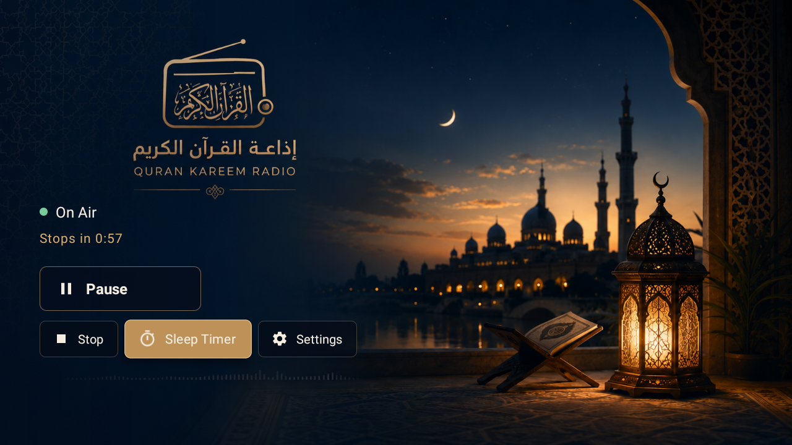
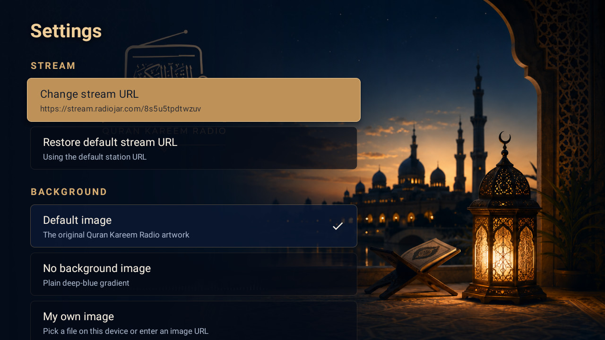

# Quran Kareem Radio TV — إذاعة القرآن الكريم

An Android TV app that streams **إذاعة القرآن الكريم من القاهرة** (Quran Kareem Radio, Cairo).

Built and verified on a real Android TV (Xiaomi Mi TV, Android 10 / API 29, 1280×720).
## Screenshots



## Install

```bash
adb install -r app/build/outputs/apk/debug/app-debug.apk
```

The APK at `app/build/outputs/apk/debug/app-debug.apk` is signed with the standard debug
key and installs directly. `assembleRelease` produces an *unsigned* APK — it needs your own
keystore before it can be installed, so use the debug APK unless you plan to publish.

## Features

- **Live playback** of the station with automatic retry (5 attempts, backing off) when a
  live stream drops out.
- **Play / Pause / Stop** as three large D-pad targets. Stop fully tears the stream down;
  Pause keeps the session alive.
- **Sleep timer** with 5 / 15 / 30 minute and 1 hour presets plus a custom value
  (1–600 minutes). A live countdown shows under the status line, and the timer keeps
  running while you're in Settings or have left the app.
- **No in-app volume control** — deliberately left to the remote's own volume keys.
- **Full remote support**: D-pad navigation, and the transport keys
  (PLAY / PAUSE / PLAY_PAUSE / STOP) work through a MediaSession even when the app is
  in the background. MENU opens Settings.
- **Arabic and English** — the UI follows whatever language the TV is set to.

## Settings

Reachable from the **Settings** button or the remote's **MENU** key. Everything persists
across restarts and reboots.

| Setting | Notes |
| --- | --- |
| Change stream URL | For when the default stream goes down. Must be `http://` or `https://`. |
| Restore default stream URL | Back to `https://stream.radiojar.com/8s5u5tpdtwzuv`. |
| Background: Default image | The supplied artwork. |
| Background: No background image | Plain deep-blue gradient. |
| Background: My own image | Pick a file on the device, or enter an image URL. |
| Restore default background | Background only. |
| Restore all default settings | Stream URL *and* background, after a confirmation. |

Remote images are cached on disk, so a custom background from a URL still appears when
the network is down.

## Layout notes

The controls sit at the **left-centre**, clear of the mosque and lantern in the artwork.
The root layout is pinned to `ltr` on purpose — the artwork's empty area is on the left,
so the panel must stay there even when the TV is set to Arabic. Text still shapes
right-to-left normally.

When the default artwork is showing, the app hides its own station title: the artwork
already carries the wordmark. Switch to "no background" or a custom image and the title
appears, with the panel recentred vertically.

## Building

Requires JDK 17+ and the Android SDK (compileSdk 34).

```bash
./gradlew :app:assembleDebug
```

If `JAVA_HOME` isn't set, Android Studio's bundled JDK works:

```bash
export JAVA_HOME="/Applications/Android Studio.app/Contents/jbr/Contents/Home"
```

## Project layout

| File | Role |
| --- | --- |
| `MainActivity.kt` | Player UI, remote key handling, sleep-timer dialogs |
| `SettingsActivity.kt` | Settings list, stream URL and background pickers |
| `PlaybackService.kt` | ExoPlayer + MediaSession, retry logic, foreground playback |
| `Prefs.kt` | Persisted settings and their defaults |
| `SleepTimer.kt` | Process-wide countdown, independent of the Activity |
| `BackgroundLoader.kt` | Resolves default / none / custom backgrounds, with caching |

Minimum Android 5.0 (API 21), targets API 34.
